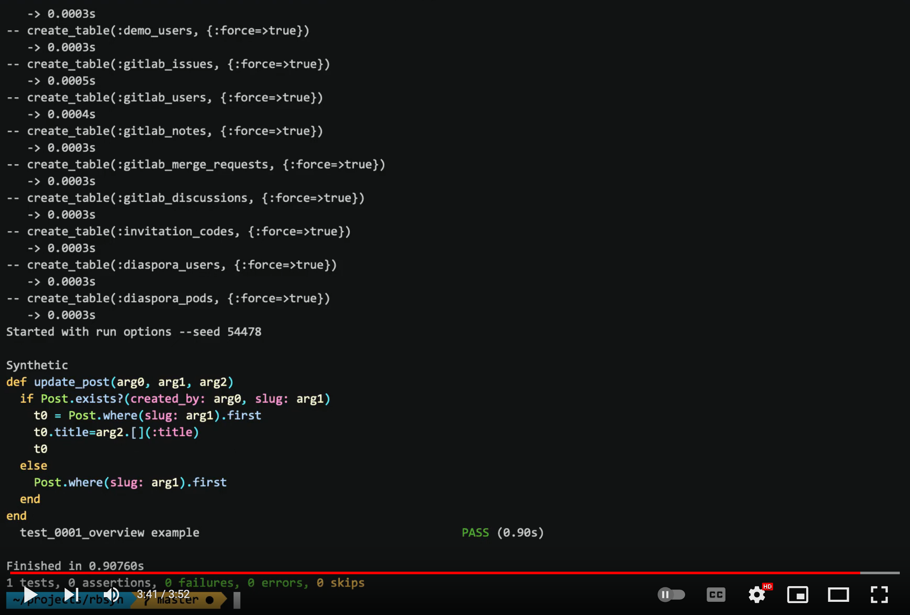

# RbSyn


Program synthesis for Ruby, guided by type and effect annotations. See the [PLDI 2021](https://sankhs.com/static/rbsyn-pldi21.pdf) paper for more details on the approach.

Given a method specification in the form of tests, type and effect annotations with [RDL](https://github.com/tupl-tufts/rdl), this synthesizes a Ruby function that will pass the tests. This reduces programmer effort to just writing tests that specify the function behavior and the computer writing the function implementation for you.

## Demo

[](https://www.youtube.com/watch?v=yYAOK5S8lRY "RbSyn Demo YouTube Video")

## Installation

You need a working Ruby installation with [Bundler](https://bundler.io/) installed. Then install all the dependencies by executing `bundle install`.

We have tested RbSyn on Ruby 3.2.2 with Bundler 2.4.22. Other versions should work, but we have not tested it. Let us know if there are any issues.

## Running Tests

All the benchmark programs can be run using the following command:

```
bundle exec rake bench
```

Prefix the environment variable `CONSOLE_LOG=1` to the above command to print the synthesized method. To run a single test use the following command:

```
bundle exec rake bench TEST=<path-to-test-file>
```

All the benchmarks can be found in [`test/benchmark`](test/benchmark) and custom benchmarks can be run by updating in [`Rakefile`](Rakefile) in line 15, for the `t.test_files` value.

## Environment Variables

Multiple flags can be passed to RbSyn to explore different configurations of synthesis:

* `CONSOLE_LOG=1`: Print the programs that are bring synthesized.
* `DISABLE_TYPES=1`: Disable type directed synthesis.
* `DISABLE_EFFECTS=1`: Disable effect guided synthesis.
* `EFFECT_PREC=0` or `EFFECT_PREC=1` or `EFFECT_PREC=2`: Set the level of effect precision to use. 0 is the most precise, 1 is class level precision and 2 reduces annotations to pure or impure only.

These environment variables can be passed in any combination in the bench command like so:

```
CONSOLE_LOG=1 DISABLE_EFFECTS=1 bundle exec rake bench

BRYAN MODS
To run my version call CONSOLE_LOG=1 DISABLE_EFFECTS=1 bundle exec rake notypes
```

## Using RbSyn

You can try to play with the implementation of RbSyn, the purpose of some of the key modules are given in the file structure section above.

To write a new test, you can either copy an example from the existing benchmark and modify it. Update the `Rakefile` so the `t.test_files` contain your new benchmark.

Benchmarks follow roughly this format:

```ruby
# type definitions for methods that will be used for synthesis
RDL.type Array, :first, '() -> t', wrap: false

define :username_available?, "(String) -> %bool" do

  spec "returns true when user doesn't exist" do
    username_available? 'bruce1'

    post { |result|
      result == true
    }
  end

  spec "returns false when user exists" do
    setup {
      u = User.create(name: 'Bruce Wayne', username: 'bruce1', password: 'coolcool')
      u.emails.create(email: 'bruce1@wayne.com')
    }

    username_available? 'bruce1'

    post { |result|
      result == false
    }
  end

  puts generate_program
end
```

The above `generate_program` runs RbSyn and produces the following snippet:

```ruby
def username_available?(arg0)
  !User.exists?(username: arg0)
end
```

By default RbSyn will only use "" (empty string), 0 and 1 for constants during synthesis. To include some other constants in this set, add them to `lib/rbsyn/context.rb` lines 26 and 27.

`nil` is not synthesized by default, to enable the synthesis of `nil` set the option `enable_nil: true`. For an example see, `test/benchmark/diaspora/user_confirm_email_benchmark.rb`.

## Issues, questions or comments?

Please file an issue on Github if you have problem running RbSyn. Feel free to send an email to sankha@cs.umd.edu.

---

_Logo derived from icon by [ultimatearm](https://www.flaticon.com/authors/ultimatearm) from [www.flaticon.com](https://www.flaticon.com/)._

## BRYAN ADDED FILES

* `lib/rbsyn/ast/check_error_pass.rb` : checks for errors in incomplete terms based upon the emperically determined types. 
* `lib/rbsyn/ast/infer_types.rb` : Class that contains instrument method and type recording / comparison functions.
* `lib/rbsyn/ast/track_rewrite.rb` :  Used to rewrite ast with the instrument wrapper placed around any methods of interest. 
* `test/benchmark/noTypes/sumTwo_benchmark.rb` : Contains test benchmark for new funcitonality, this version creates an error that needs to be understood
* `test/benchmark/noTypes/sumTwo_nobug.rb` : Contains test benchmark for new funcitonality, this version is constrained to show functionallity without bug. 


## BRYAN AUGMENTED FILES 

* `Rakefile` : Added new benchmarks for quick testing. 
* `lib/rbsyn/ast.rb` : Added method `eval_ast_second(ctx, ast, precond, mth)` inserts the provided instrument class "mth" using "track_rewrite" before executing a candidate. 
* `lib/rbsyn/syn_helper.rb` : Changed sorting method to use the new error count to penalize candidates + command line logging for ease of debugging + implemented "eval_ast_second" where there was formerly "eval ast".
* `lib/rbsyn/prog_wrapper.rb` : Added the atrribute + accessor `inferred_errors` for sorting purposes. 


## BR To Run

* To run the benchmark that reveals the error : CONSOLE_LOG=1 DISABLE_EFFECTS=1 bundle exec rake notypes
* To run the benchmark that is constrained to show the existing functionallity : CONSOLE_LOG=1 DISABLE_EFFECTS=1 bundle exec rake notypes_nobug

## BR NOTES and TODOS

* The bug appears when line 14 in the benchmark has `RDL.type :BasicObject, :+, "(%dyn) -> %dyn"` the last `$dyn` as opposed to `Integer` is what is revealing the error. 
* The sorting may not be working as intended, it might be re-inserting completed programs that have failed the test, on `lines 133 and 144` and the programs that have 
already been tested do not have a penalty score assigned to them, therefore prioritizing these over exploration. An easy way to fix this might be to add between lines 115 and 116
`prog_wrap.inferred_errors += 10000` artifically asigning them an arbitrarially high score. 
* My current error assignment method only assigns an error score to the newest generated terms on line `129` (IE it doesn't backtrack to update older terms with newly discovered information)
this may be a bad approach, I would like to consider, instead, inserting the new terms into the worklist and then re-checking for type errors across the entire list before sorting near line `144`.
* I am currently using explicit string casts to compare RDL types in many places, this is only because of my own limitations in understanding, this will be best updated to directly compare types. 


* TODO add support for dynamic types in the reachability file and the typeops file. 